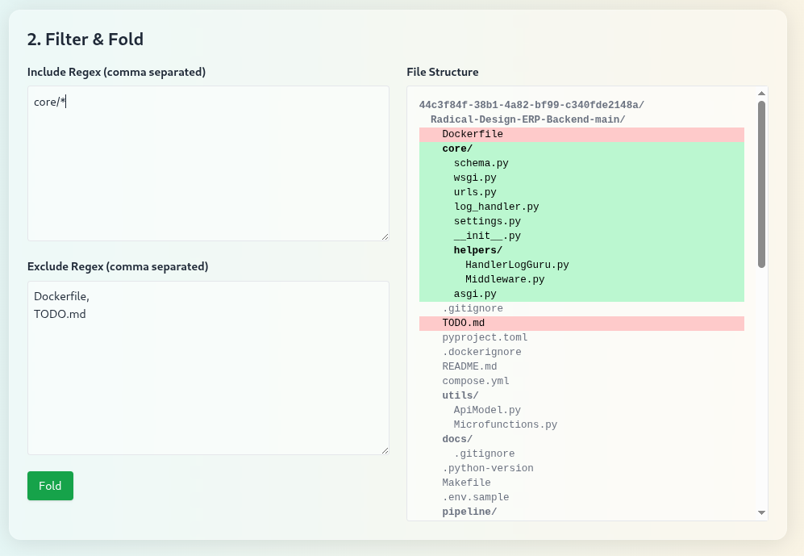
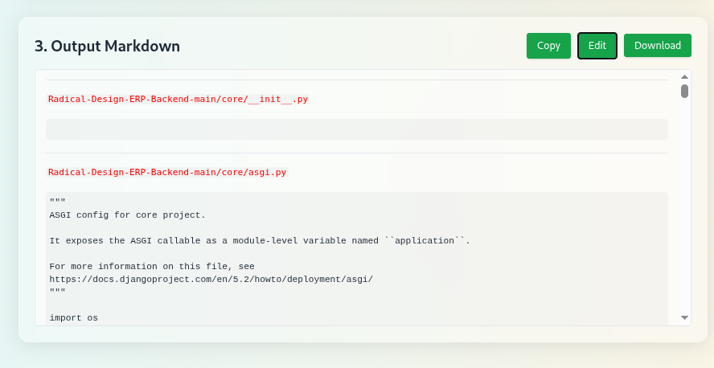

# SourceFold - A Ultimate Tool For Vive Coders to utilize AI 

**SourceFold** is a utility tool that collapses an entire codebase into a single file. This is especially useful for feeding source code into AI models or LLMs that require full context in a linear, compact format.

  
  

## How To Use IT:
- Upload your codebase and get all the files in single markdown file . 
- Upload it to [Qwen](https://chat.qwen.ai/) or any related AI. 
- Now AI Know your codebase.


## Features

- Recursively reads project directories
- Concatenates all source files into one unified file
- Preserves relative file paths and boundaries as comments
- Supports multiple programming languages
- Ignores unnecessary files and folders (e.g., `.git`, `node_modules`, `__pycache__`, etc.)

## Use Cases

- Feed complete codebase context to AI/LLM
- Analyze project structure in a single glance
- Archive source code in a simplified format
- Assist in static code analysis pipelines

## Installation

```bash
git clone https://github.com/0xAungkon/SourceFold.git
cd SourceFold
pip install -r requirements.txt
make start
```

Or Just Use Docker
```bash
docker compose up -d
```

**Now Hit into: [http://localhost:8000](http://localhost:8000)**
